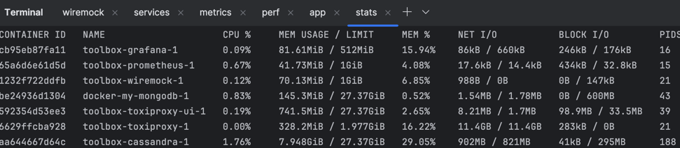

# devcon-nov-2024
## Why testing performance has a critical role in Spring applications?

In this demo, we will show how implementing performance tests could improve Spring Boot application’s performance.

We will discuss methodologies employed, key performance metrics monitored, and specific optimization derived from test results.

We will demonstrate the critical role performance testing has in identifying bottlenecks, and you will learn how to optimize resource utilization to ensure the application delivers a seamless user experience under varying load conditions.

### How to use this repo?
You can start several containers from this repo to be able to test your application.


### [Wiremock](https://wiremock.org/docs)
WireMock is a popular open-source tool for API mock testing, with over 5 million downloads per month. It can help you to create stable test and development environments, isolate yourself from flakey 3rd parties and simulate APIs that don't exist yet
```shell
docker-compose -f toolbox/docker-compose.wiremock.yaml up
```
### [Cassandra](https://cassandra.apache.org/_/index.html)
We start a database we can connect to from the app
```shell
docker-compose -f toolbox/docker-compose.services.yaml up
```

### [Toxiproxy](https://github.com/Shopify/toxiproxy/pkgs/container/toxiproxy)
```shell
docker-compose -f toolbox/docker-compose.toxiproxy.yaml up
```
At the moment, there is no `shopify/toxiproxy` image for `linux/arm64`. We can create our own using the command below:
```shell
export DOCKER_DEFAULT_PLATFORM=linux/arm64
docker build -f Dockerfile-toxiproxy --tag=shopify/toxiproxy:latest ./ --no-cache
```

### Monitoring

We use Prometheus to scrape metrics from our Spring Boot application via the actuator endpoint
and Grafana to visualize some metrics
```shell
docker-compose -f toolbox/docker-compose.metrics.yaml up
```

### Docker

We can see the available resources currently used by each container
```shell
 docker stats
```

### App
We need to build the application

```shell
mvn install
```

And create the new local Docker image
```shell
    export DOCKER_DEFAULT_PLATFORM=linux/arm64
    docker build -f sample-app/Dockerfile --tag=app:latest ./ --no-cache
```

We can start it

```shell
docker-compose -f toolbox/docker-compose.app.yaml up app
```

### Running our first perf test

Create the image
```shell
export DOCKER_DEFAULT_PLATFORM=linux/arm64
docker build -f Dockerfile-wrk --tag=wrk:latest ./ --no-cache
```

In the `docker-compose.perf.yaml` file you can set the url you want to test.
With `http://app:8080/api/v1/accounts-async-cql-template-after/123` you can see a bottleneck
```shell
docker-compose -f toolbox/docker-compose.perf.yaml up wrk-app
```
From the logs we see:
```text
app-1  | com.datastax.oss.driver.api.core.DriverTimeoutException: Query timed out after PT2S
app-1  |        at com.datastax.oss.driver.internal.core.cql.CqlRequestHandler.lambda$scheduleTimeout$1(CqlRequestHandler.java:207) ~[java-driver-core-4.17.0.jar!/:na]
app-1  |        at io.netty.util.HashedWheelTimer$HashedWheelTimeout.run(HashedWheelTimer.java:706) ~[netty-common-4.1.107.Final.jar!/:4.1.107.Final]
app-1  |        at io.netty.util.concurrent.ImmediateExecutor.execute(ImmediateExecutor.java:34) ~[netty-common-4.1.107.Final.jar!/:4.1.107.Final]
app-1  |        at io.netty.util.HashedWheelTimer$HashedWheelTimeout.expire(HashedWheelTimer.java:694) ~[netty-common-4.1.107.Final.jar!/:4.1.107.Final]
app-1  |        at io.netty.util.HashedWheelTimer$HashedWheelBucket.expireTimeouts(HashedWheelTimer.java:781) ~[netty-common-4.1.107.Final.jar!/:4.1.107.Final]
app-1  |        at io.netty.util.HashedWheelTimer$Worker.run(HashedWheelTimer.java:494) ~[netty-common-4.1.107.Final.jar!/:4.1.107.Final]
app-1  |        at io.netty.util.concurrent.FastThreadLocalRunnable.run(FastThreadLocalRunnable.java:30) ~[netty-common-4.1.107.Final.jar!/:4.1.107.Final]
app-1  |        at java.base/java.lang.Thread.run(Thread.java:1583) ~[na:na]

```
Grafana shows slow responses


We can run again the same test for `http://app:8080/api/v1/accounts-spring-data-cf-then-apply/123` and see the differences

